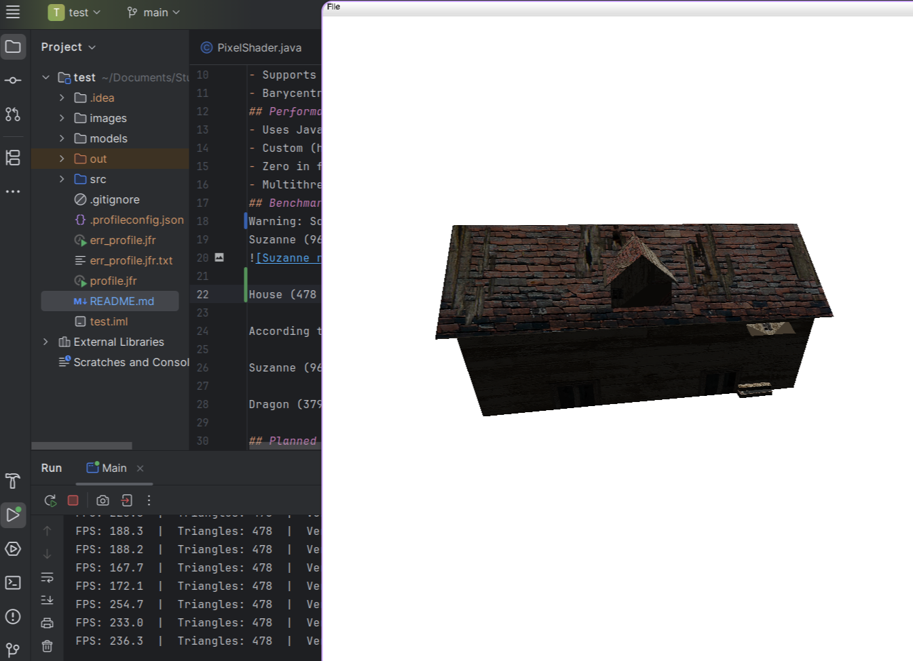
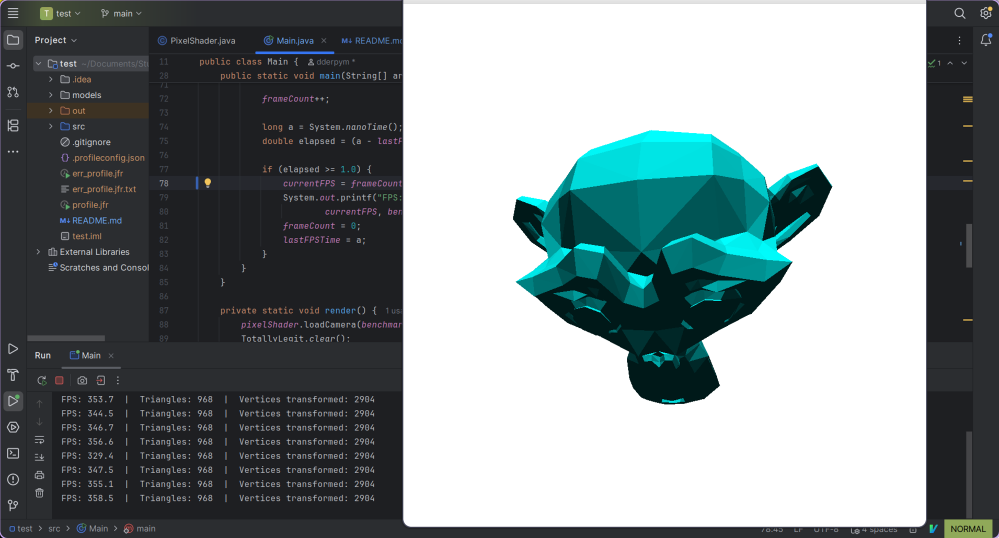

# TotallyLegit3D — A Fast CPU Software Rasterizer in Java

TotallyLegit3D is a real-time software rasterizer written entirely in Java using the standard libraries of UC Berkeley's CS61B. It does not make use of GPU calls through libraries like OpenGL and Vulkan. StdDraw operates through Java Swing, and TotallyLegit utilizes Java reflections to achieve substantially faster performance on the normal StdDraw pannel. Despite relying on CPU-only rendering, the engine achieves reasonable performance under fairly high poly counts.

## Real-Time CPU Rendering
- Custom vertex processing, raster, depth buffering, and color output.
- Supports STL and OBJ meshes in configurable render scenes.
- Fully supports diffuse UV textures on obj models.
- Barycentric raster pipeline with backface culling.
## Performance
- Uses Java reflection to access private StdDraw buffers, reducing 1 million random-pixel-write time from 235 ms → 4.5 ms (~50× faster).
- Custom (hacked) buffering that reduces screen-blit time by 2–3× (over StdDraw).
- Zero in flight allocation architecture, bypassing GC pressure.
- Multithreaded raster and vertex stage.

_Using Java reflections to obtain access to the private BufferImage under StdDraw_

## Benchmarks
Textured Benchmarks:
House (478 triangles) (textured, no backface culling): ~200 FPS (Ryzen 7, 5825U, 8 threads)

Suzanne (968 triangles) (textured): ~230 FPS (Ryzen 7 5825U, 7 threads)

Legacy benchmarks:
Suzanne (968 triangles): ~350 FPS (Ryzen 7 5825U, 7 threads)


My friend with an M3 (which I suspect is faster due to much faster memory bandwidth) told me he achieved these results:

Suzanne (968 triangles): ~800 FPS (Apple Silicon M3, 4 threads)

Dragon (37986 triangles): 300 FPS (Apple Silicon M3, 4 threads)

## Planned Features
- Implement tile based rendering and use the more optimized parallel streams java library for better cache locality and whatever multithreading advantages java streams will hopefully bring as a big industrial (optimized?) library.
- Clean up all the public variables to adhere better to standard OOP principles. (we'll see if that affects performance).

## Multithreading Status
- Raster Stage: Multithreaded in horizontal strips. Tile rendering with a small cacheable array for better cache locality is planned.
- Vertex Stage: Fully multithreaded.

## Running and building
As this was a school project, I've created this similar to the rest of the projects in the same class. Thus, the build tooling is quite lacking.
I will eventually add proper tooling to this, however, in the meantime:

### Option 1: IntelliJ (recommended)
Open the project in IntelliJ and add the CS61B `algs4.jar` library manually.

### Option 2: Command Line
From the project root:
```
cd src
javac -cp ".:/path/to/algs4.jar" *.java math/*.java
```
To execute, in the src directory, run 
```
java -cp ".:/path/to/algs4.jar" src/Main
```

By default it is configured to display a house (included in the repository). You may modify the settings in Main.java.
